# Quizology - A Quiz App

Link to [Quizology](https://martinfjellstrom.github.io/MS2-Quiz/)
 site

This is an online quiz game for users intressted in trivia. The game apeals to a wide variety of users as it covers a selection of subjects suited to different intrests.
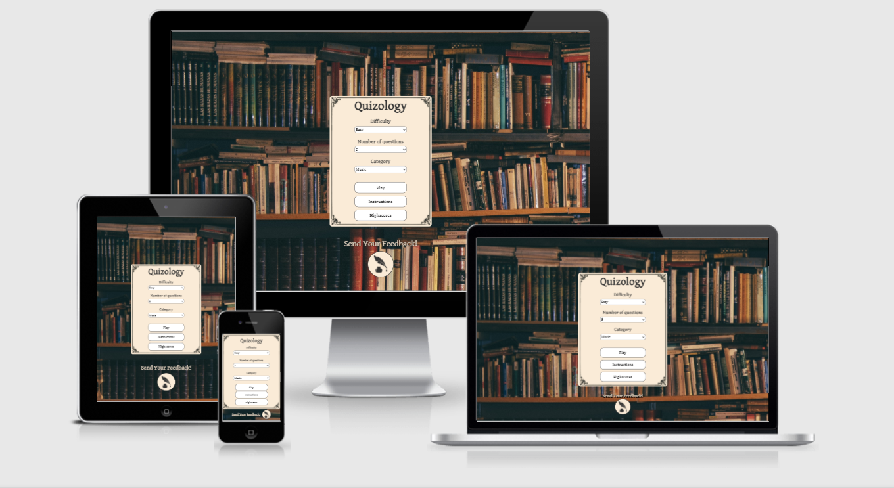

# Table of Contents

- [UX](#ux)
    - [User Stories](#user-stories)
    - [Design](#design)
- [Features](#features)
- [Technologies Used](#technologies-used)
- [Testing](#testing)
    - [Code Validation](#code-validation)
    - [Testing User Stories](#testing-user-stories)
    - [Compatibility Testing](#compatibility-testing)
    - [Performance Testing](#performance-testing)
    - [Bugs](#bugs)
- [Deployment](#deployment)
- [Credits](#credits)
    - [Media](#media)
    - [Code](#code)
- [Acknowledgements](#acknowledgements)

# UX

## User Stories

#### As a new player of Quizology I want:

* To easily be able to navigate through the site and find everything I need.

* A responsive site so that I can access the game on different devices.

* To easily be able to access instructions to understand how to play the game. 

* To to be able pick from different subject categories depending on my interests.

* To select a difficulty level so that I can play the game according to my abilities.

* To pick the amount of questions so that I can have control over how long I play.

#### As a player playing Quizology I want:

* A confirmation of my answer and to know which one is correct if I answer wrongly. 

* To see the remaining amount of questions. 

* To keep track of my current score.

* To be able to save my final score to a high score list.

#### As a returning player of Quizology I want:

* A wide selection of subjects to have more variety.

* A big pool of questions for less repetition when answering questions from subjects more than once.

* To be able to give feedback to the creator to contribute to further improvment of the game.

* To be able to check and compare past scores.

## Design

### Colour scheme

#### The main colours used throughout the site are:

Antiquewhite rgb(250, 235, 215)      

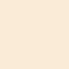        

Chalk white rgb(251, 247, 245)    

Darkslategray rgb(51, 51, 51) 

Sienna rgb(184, 149, 86)
      

### Fonts

The main fonts used throughout the site are [Gentium Book Basic](https://fonts.google.com/?query=jura), [Stylish Marker](https://fonts.google.com/?query=black+ops+one) and [Satisfy](https://www.1001fonts.com/stylish-marker-font.html) with Serif 
as a fallback font should the font not be supported by the user’s browser. The fonts were chosen to fit the old-timey educational theme of the game and improve the user experience. Satisfy was chosen to imitate chalk writing on the blackboard of the high scores page.

### Imagery

All the imagery on the site was chosen to enhance the user experience by providing a consistent and fun theme throughout. The background image is there to set the theme of the game and gives the user a feeling of being in a classic educational environment. This image was the starting point for the rest of the styling across the site and influenced other small details. The game container image is an open book to further enhance the theme, and the high scores background image is a blackboard to fit the educational feel.

# Features

## Existing Features

* **Responsiveness on all device sizes** – allows users to access the site from any device.

* **Game settings** – allows the user so customise the gameplay.

* **Play button** - allows users to easily start the game from the landing page.

* **instructions** - gives the user a quick guide for how to play the game and filter the high scores.

* **High score lists** – allows users see the previously achived scores. 

* **High score filters** - allows the user to filter the highscore list according to the selected game settings.

* **Back to home buttons** – allows the user the go back to the landing page from the high scores page and from the end page where the final score is shown. 

* **Feedback button** - opens a feedback form in a modal which allows the user to send some feedback to the site creator.

* **Question counter** – shows the number of answered and remaining questions.

* **Progress bar** – shows the percentage of progressin a bar under the question counter.

* **Score counter** – show the users current score. 

* **Correct/incorrect answer highlighting** – highlights the selected answer and the correct answer if the selected answer is incorrect.

* **Final score** – shows the final score after finishing the game.

* **Save button** - allows the user to locally save their score to a high score list.

## Features left to implement

* Sound effects to enhance the user experience.

# Technologies Used 

## Languages Used

* [HTML5](https://en.wikipedia.org/wiki/HTML5)
* [CSS3](https://en.wikipedia.org/wiki/CSS)
* [JavaScript](https://en.wikipedia.org/wiki/JavaScript)

## Frameworks, Libraries & Programs Used

* [Google fonts](https://fonts.google.com/) – used to import fonts into the style.css file.
* [Font Awesome](https://fontawesome.com/) – used to import icon for the close button on the feedback modal.
* [GitHub](https://github.com/) – used to store the projects code after being pushed from Git.
* [GitPod](https://gitpod.io/) – used to edit the projects code before committing it to Git.
* [Git](https://git-scm.com/) – used for version control of the code.
* [W3 Jigsaw](https://jigsaw.w3.org/css-validator/) – used to validate the CSS code.
* [W3C validator](https://validator.w3.org/) – used to validate the HTML code.
* [JShint validator](https://jshint.com/) used to validate the JavaScript code.
* [Chrome DevTools](https://developers.google.com/web/tools/chrome-devtools) – used to debug and test code. Also used for performance testing with lighthouse.
* [PicPick](https://picpick.app/) – used to screen capture pages for use in the README file.
* [Eye Dropper](https://chrome.google.com/webstore/detail/eye-dropper/hmdcmlfkchdmnmnmheododdhjedfccka) – used to get colour from picture.
* [Paint](https://en.wikipedia.org/wiki/Microsoft_Paint) - used to make colour samples in the README file.
* [Open Trivia DB API](https://opentdb.com/api_config.php) - used to fetch questios for the game.
* [EmailJS](https://www.emailjs.com/) - used to get a email feedback function.

# Testing

## Code Validation
For testing W3C Markup Validation Service was used to validate the HTML code, W3C CSS Validation Service was used to validate the CSS code and JSHint was used to test the JavaScript code.

### **HTML**

#### Instructions.html code errors:
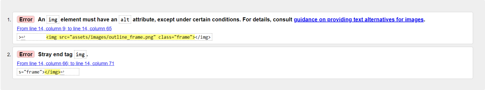

#### Instructions.html fixes:
* Removed a closing tag from the img element and added an alt attribute.

#### Index.html code errors:
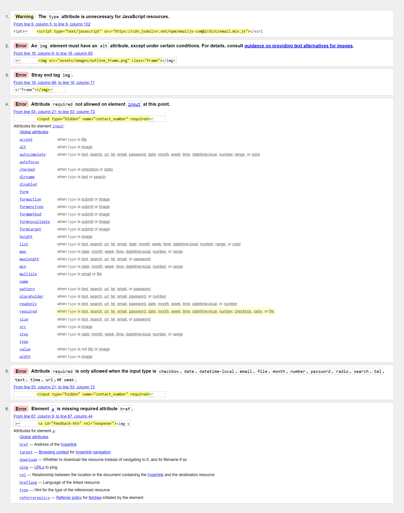

#### Index.html fixes:
* Removed the type attribute from the emailJS link.
* Removed a closing tag from the img element and added an alt attribute.
* Removed the required attribute on the "contact_number" input element.
* Added an empty href attribute on to the "feedback-btn".

#### Highscores.html code errors:
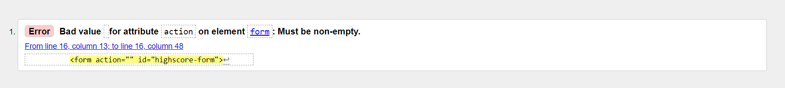

#### Highscores.html fixes:
* Removed the action attribute from the form

#### End.html code errors:
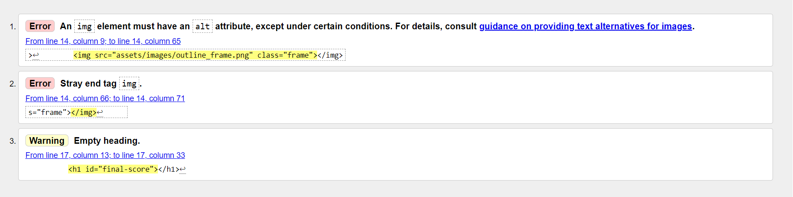

#### End.html fixes:
* Removed a closing tag from the img element and added an alt attribute.

### **CSS**

#### Highscore.css code errors:
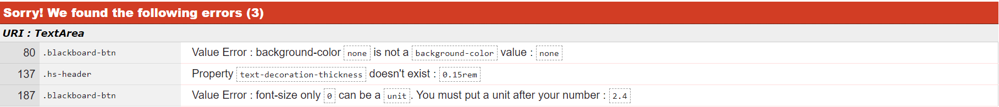

#### Highscore.css fixes:
* Removed the properties on line 80 and 137. 
* Added rem as a measurement after the font size value on line 187.

#### Game.css code errors:
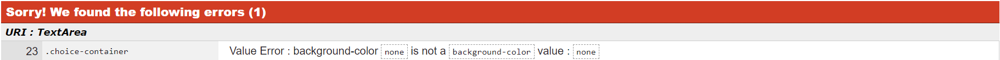
#### Game.css fixes:
* Removed the background-color property from line 23

### **JavaScript**

#### Contact.js code errors:
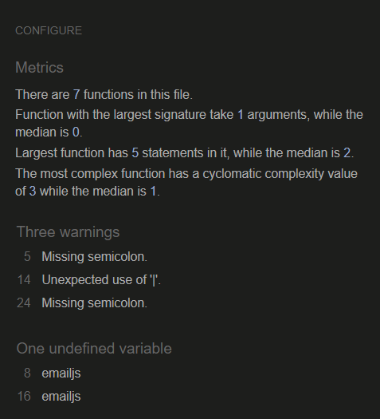

#### Contact.js fixes:
* Added a semicolon in a couple of places.
* Added a vertical bar on line 12 where it was missing.

#### End.js code errors:
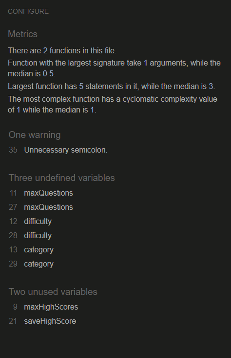

#### End.js fixes:
* Removed one unnecessary semicolon.
* Removed an unused variable  .

#### Game_settings.js code errors:
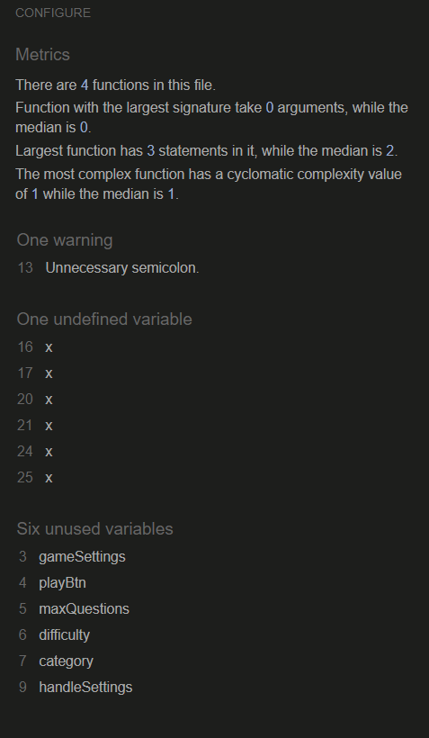

#### Game_settings.js fixes:
* Removed one unnecessary semicolon.

#### Game.js code errors:
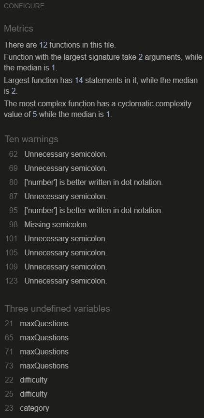

#### Game.js fixes:
* Removed 7 unnecessary semicolons.
* Added a semicolon where it was missing. 
* Changed from bracket notation to dot notation on two separate  places.

#### Highscores.js code errors:
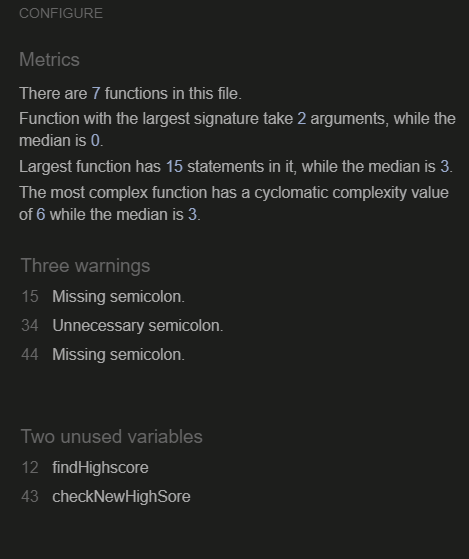

#### Highscores.js Fixes:
* Removed an unnecessary semicolon.
* Added two semicolons where needed.

## Testing User Stories

### As a first time visitor I want:

#### To easily be able to navigate through the site and find everything I need.
* All the buttons on the site have a hover effect to guide the user when selecting.
* The menus on both the landing page and the end page are centred and clearly visible
* The instructions page helps the user to understand how to navigate and use the site.
* All drop downs and buttons are clearly labelled.

	
#### A responsive site so that I can access the game on different devices.
* The site is responsive so it looks good on whichever device is used.
* The high score list and filter is easy to toggle between when using the site on a mobile device.

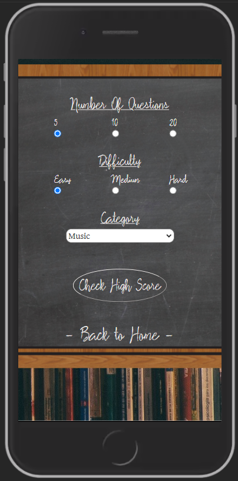

#### To easily be able to access instructions to understand how to play the game. 
* There is an instructions page that can easily be reached from the menu on the landing page. 

#### To be able pick from different subject categories depending on my interests.
* There is a category drop down in the main menu on the landing page where the user can pick between several subjects before starting the game.

#### To select a difficulty level so that I can play the game according to my abilities.
* There is a difficulty drop down in the main menu on the landing page where the user can pick between easy, medium and hard levels before starting the game.

#### To pick the amount of questions so that I can have control over how long I play.
* There is a number of questions drop down in the main menu on the landing page where the user can pick between 5, 10 or 20 questions before starting the game.

### As a player playing Quizology I want:

#### A confirmation of my answer and to know which one is correct if I answer wrongly.
* After selecting an answer the selected answer is highlighted green if answered correctly and red if incorrectly.
* If an answer is incorrect the correct answer is still highlighted with a green colour.

	
#### To see the remaining amount of questions.
* The game page has a question counter which displays the number of the current question as well as the total amount of questions in that game.
* The game page has a progress bar that incrementally fills up when moving to the next question.
	
#### To keep track of my current score.
* The game page has a score counter is the top right corner that shows the users current score
* After finishing a game the final score is clearly displayed on the ending page

#### To be able to save my final score to a high score list.
* After finishing a game the user has the option to save the final score to a local storage in their browser by entering their username in a text field and pressing the save button.
* The high score list can be reached from the landing page menu by pressing the high score button.

### As a returning player of Quizology I want:

#### A wide selection of subjects to have more variety.
* The user gets several subjects to choose from on the category drop down menu on the landing page.

	
#### A big pool of questions for less repetition when answering questions from subjects more than once.
* Every time API is called, the site fetches 40 questions and adds them to a list from which the user's selected number of questions are randomly picked by the game.
	
#### To be able to give feedback to the creator to contribute to further improvement of the game
* At the bottom of the landing page there is a button with an invitation above it to send feedback. 
* By pressing the button they open a form where they have to fill in their name, email and message. 
* The message goes straight to my email.

	
#### To be able to check and compare past scores.
* On the high score page the user can filter through different high score lists by choosing selected game settings and pressing "check high score" button.
* The high score list will show them their top 5 scores in order of how many points they got.
* The user will find instructions how to filter and load high scores in the instructions page.

## Compatibility Testing

### The site was tested in the following browsers:

* [Firefox](https://www.mozilla.org/)

* [Edge](https://www.microsoft.com/edge)

* [Opera](https://www.opera.com/)

* [Chrome](https://www.google.se/chrome/)

### [Am I Responsive](http://ami.responsivedesign.is/) was used to test responsiveness on the following devices:

* **Desktop** 1600x992px

* **Laptop** 1280x802px

* **Tablet** 768x1024px

* **Mobile** 320x480px

## Performance Testing

### I tested the site with lighthouse in Chrome Devtools and got this result:

### Then I applied the following changes to improve the result:

### The final result: 

## Bugs

# Deployment

## GitHub Pages

### The project was deployed to GitHub pages using the following steps:

1. Login to Github.

2. Locate and select the “MartinFjellstrom/MS2-Quiz” repository.

3. On the top tab, locate and select "Settings".

4. Look for the "Pages" section in the leftside menu.

5. Under source, select the "Master" branch from the dropdown selection menu.

6. A second dropdown appears next to the branch dropdown. Make sure that "/(root)" is selected.

7. Press the "Save" button and the page will automatically refresh.

8. In the "Pages" section you can now find the published link to the deployed site in the coloured section under the GitHub Pages heading. 

## Making a local Clone

1. Log in to GitHub and locate the “MartinFjellstrom/MS2-Quiz” repository.
2. Click on the “Code” dropdown next to the green “GitPod” button.
3. Under Clone, select the "HTTPS" option.
4. Copy the URL shown.
5. Open your local IDE and then open the terminal.
6. Change the current working directory to the location where you want the cloned directory.
7. Type "git clone" in the terminal and then paste the URL you previously copied.

        $ git clone https://github.com/YOUR-USERNAME/YOUR-REPOSITORY

8. Press Enter to create your local clone repository.

        $ git clone https://github.com/YOUR-USERNAME/YOUR-REPOSITORY
        > Cloning into `CI-Clone`...
        > remote: Counting objects: 10, done.
        > remote: Compressing objects: 100% (8/8), done.
        > remove: Total 10 (delta 1), reused 10 (delta 1)
        > Unpacking objects: 100% (10/10), done.

## Media

### Images

* Background - https://unsplash.com/photos/YLSwjSy7stw

* Blackboard - https://www.cleanpng.com/png-blackboard-learn-wood-stain-slate-rectangle-blackb-209360/

* Game book - https://www.vhv.rs/viewpic/hJhThoT_blank-book-transparent-background-open-book-cliparts-hd/

* Wood texture for choice prefix - https://www.sketchuptextureclub.com/textures/architecture/wood/fine-wood/dark-wood/dark-raw-wood-texture-seamless-04278

* Frame border - https://www.stickpng.com/cat/miscellaneous/frames?page=1

* Quill icon - https://thenounproject.com/term/quill-pen/1053377/

## Code 

**Quiz game engine** 

[Quiz tutorial](https://www.youtube.com/playlist?list=PLDlWc9AfQBfZIkdVaOQXi1tizJeNJipEx) - Used this tutorial as a template for my Quizology site.

**EmailJS**

[emailJS](https://developers.google.com/maps/documentation/embed/get-started) – Used the documentation to get the email js function to work.

**Loader**

[Loader](https://loading.io/css/) - Borrowed some code to get a loader when starting the game.

# Acknowledgements

A big thank you to my partner Melissa for her support throughout this project.
